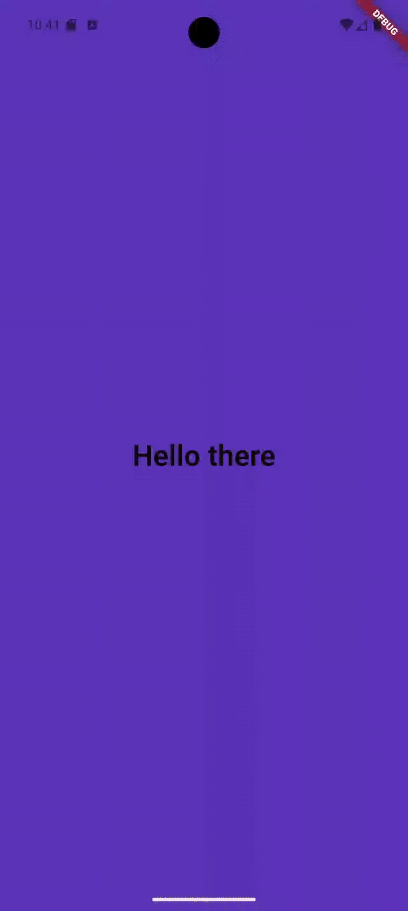

# 📱 Random Background Flutter App

A simple Flutter application that displays the text **"Hello there"** in the center of the screen. When the user taps anywhere on the screen, the background changes to either a randomly generated color or a randomly selected image.

## 🚀 Features

- Tap anywhere on the screen to change the background
- Randomly switches between:
  - One of 16,777,216 possible RGB colors
  - A set of local images
- Clean and minimal UI

## Static Code Analysis

- This project uses [`solid_lints`](https://pub.dev/packages/solid_lints) to perform static code analysis. All issues reported by the linter have been fixed to ensure clean and maintainable code.
- The following line is added to `analysis_options.yaml` to apply Solid Software’s recommended lint rules:

  ```yaml
  include: package:solid_lints/analysis_options.yaml

## 🎬 Demo



---


